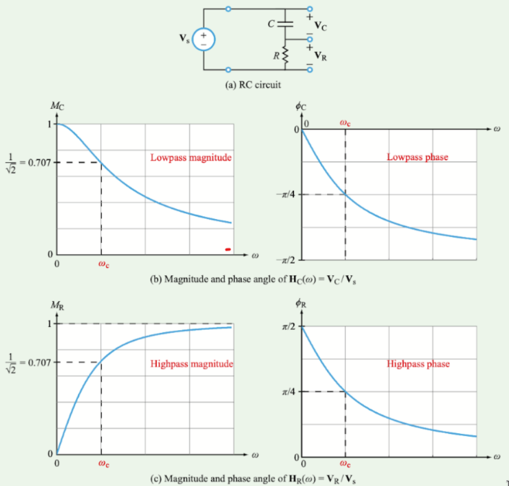
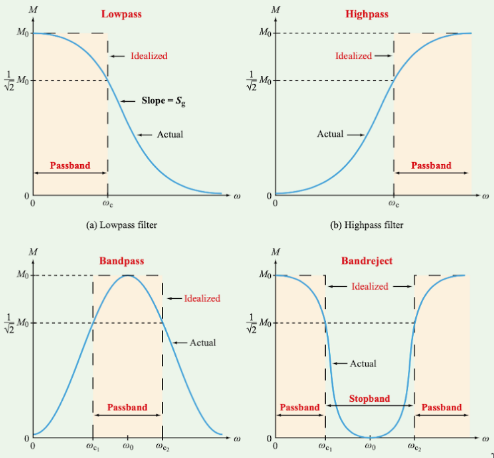
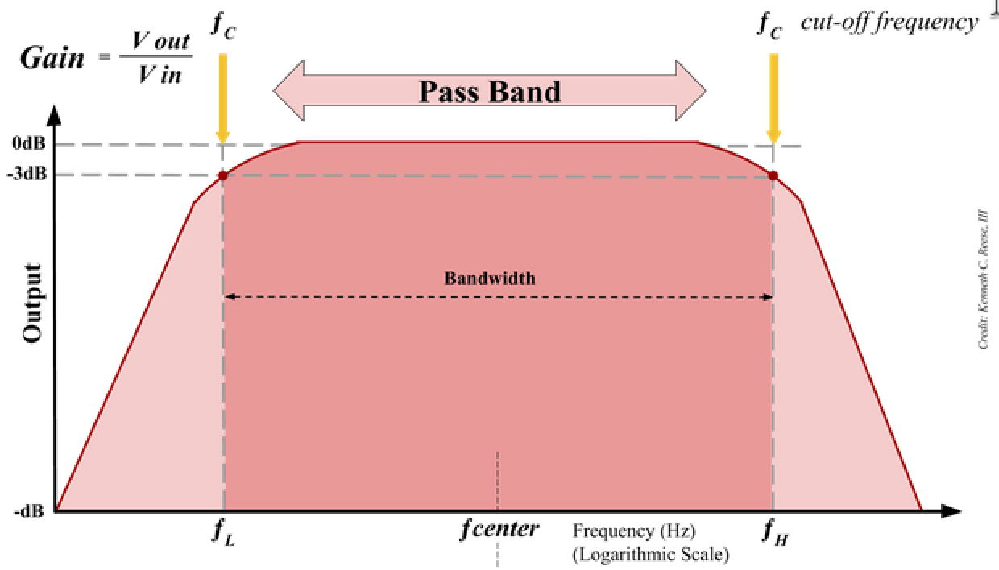

# Passive and Active Filters

## Prerequisites

A basic understanding of Bode-Plots, cut-off frequencies, and circuit components would be helpful in understanding filters as we will be analyzing the bode-plots of the transfer function of these filters.

## Definitions and Concepts

**Filters**: removes unwanted frequencies in a signal.

**Passive Filter**: essentially means there is no amplifier in the filter.

+ **Low Pass Filter** - Pass low frequencies but attenuate high frequencies.
+ **High Pass Filter** - Pass high frequencies but attenuate low frequencies.

+ **Bandpass** - Limits the bandwidth of the output signal.
+ **Band-reject** - Also known as a band-stop. Passes most frequencies unaltered but attenuates those in a specific range.

**Bandwidth** - In general, is the difference between the upper and lower frequencies in a continuous band.
+ Passband bandwidth - Difference between the upper and lower cutoff frequencies.
+ Baseband bandwidth - The upper cutoff frequency of a low-pass filter.

**Example of base bandwidth**:

**Active Filters**: Active filters are distinguished by the use of active components such as voltage amplifiers, buffers, op-amps, etc. In passive filters, the load resistance can influence the transfer function of the filter. With an active filter we can use an amplifier and buffers such that the change in load impedance will not affect the transfer function of the filter.

## Example Problem

> *Determine what kind of filter this circuit is using physical arguments.*

---

This circuit is a high pass filter. More specifically, a passive high pass filter as there are no active components. At higher frequencies, the inductor will act as an open circuit allowing R2 to receive all the current.
