# Performing Inverse Laplace Transfrom

## Prerequiste Knowledge
Before continuing to the inverse Laplace transform, you must be able to do:
* Laplace Transform
* Algebra
* Calculus II

## Applications of Inverse Laplace Transform
1. Laplace RLC circuit analysis
2. Step Response
3. Impulse Response 
4. Natural Response
5. Forced Response
6. Complete Response

## Steps for performing Inverse Laplace transform 
1. Convert transfer function into standard form
2. Perform Residue Method
3. Perform Inverse Laplace Transfrom (with Laplace chart)
4. Simplify the expression

## Inverse Laplace Transform
### Three Common Inverse Laplace Transforms

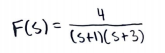 
  
In example 1, we focus on the denominator to see how to produce the equation for the residue method. The denominator is the key factor in identifying the equation to eventually solve for the inverse Laplace transform. Since the denominator for this example is two poles, (s+1) and (s+3), we know that the equivalent equation would be:

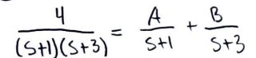 
  

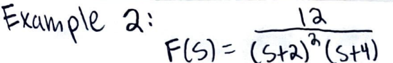 
  
In example 2, we will use the same approach. However, we can notice that there is a repeated pole in the denominator. The equivalent equation would be slighlty different than the first example and would look like this: 

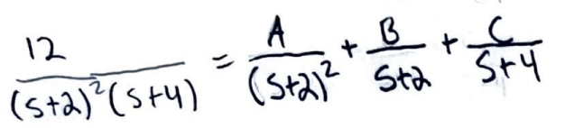 
  

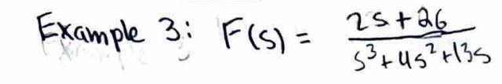 
  
In example 3, the first thing to identify in this problem is the denominator. Factoring out an s will leave the denominator as a polynomial and factored s. This will change the equivalent equation for the residue method. With the polynomial having an As+B in the numerator. The equation would look like this: 

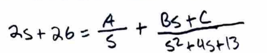 
  

These are the main three inverse Laplace transforms that will be seen through this course. 
### Example 1

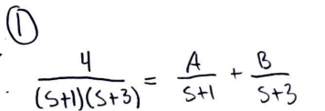 
  
Step 1. First you want to set up the residue method.

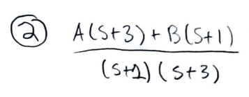 
  
Step 2. Multiply both terms by their denominator.

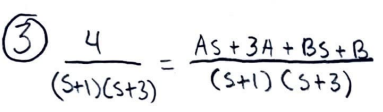 
  
Step 3. Collect like terms for A and B.

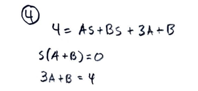 
  
Step 4. Set up equations to solve for values of A and B.

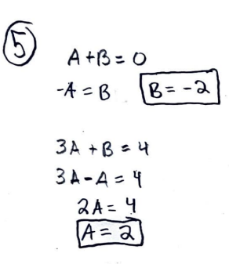 
   
Step 5. Solve for values of A and B.

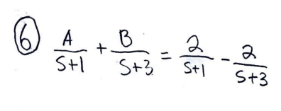 
  
Step 6. Reincorporate A and B into original equation.

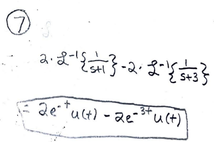 
  
Step 7. Take Inverse Laplace transform to get final answer. (Use Laplce transform chart)

### Example 2

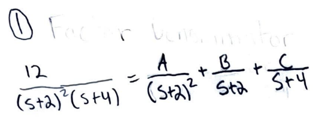 
  
Step 1. Like the first example you want to start with setting up the residue method, however this equation will be different as there is a repeated pole in the denominator.

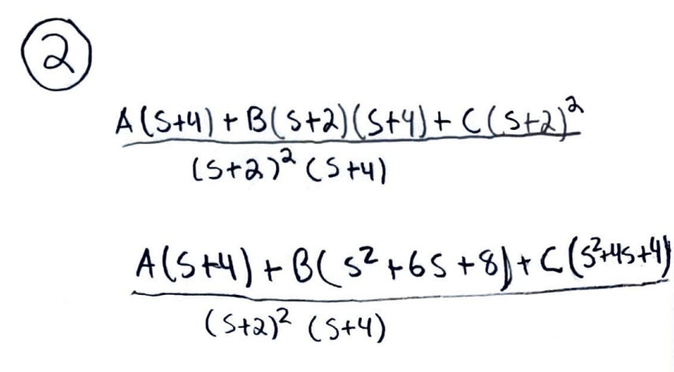 
   
Step 2. Multiply terms by other denominators to get a common denominator.

 
   
Step 3. Simplify

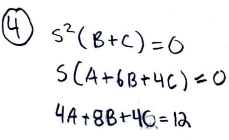 
  
Step 4. Set up equations to solve for A, B, and C

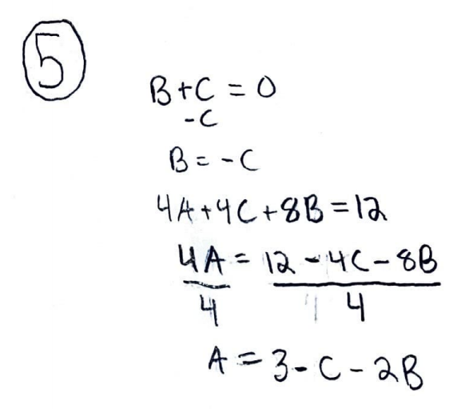 
  
Step 5. Solve for A in equation 4A+8B+4C=12. Also solve for B in B+C=0.

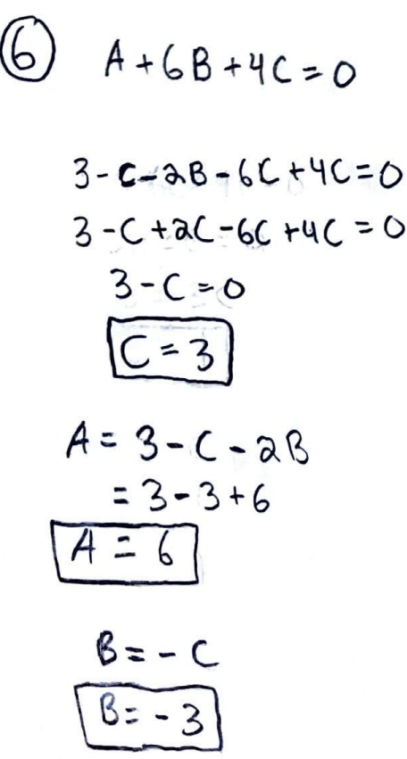 
  
Step 6. Input the value of A and B from step 5 in A+6B+4C=0, and solve for A, B, and C.

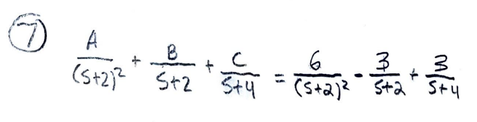 
  
Step 7. Input the values for A, B, and C into original residue equation.

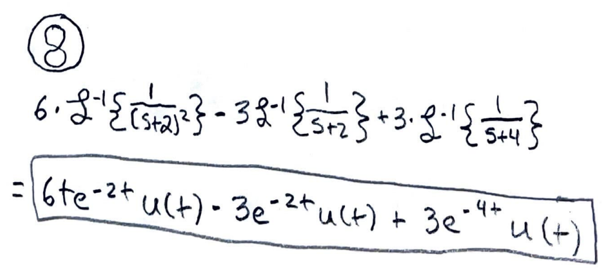 
  
Step 8. Take the inverse Laplace of step 7 to solve for the final answer. (Use Laplce transform chart)

### Example 3

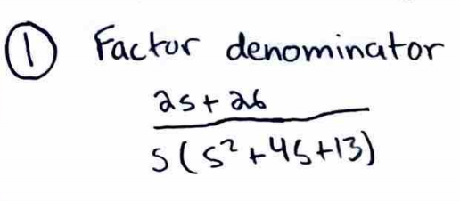 
 
Step 1. Factor denominator

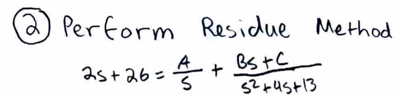 
 
Step 2. Like the first example you want to start with setting up the residue method, however this equation will be different as there is a polynomial in the denominator.

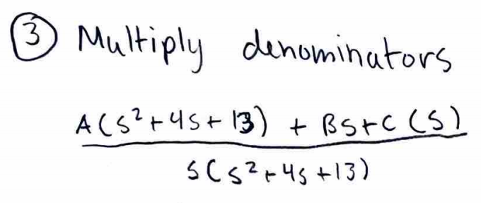 
 
Step 3. Multiply terms by other denominators to get a common denominator.

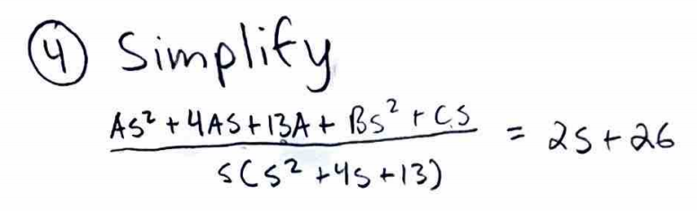 
 
Step 4. Simplify and multiply A, B, and C out. 

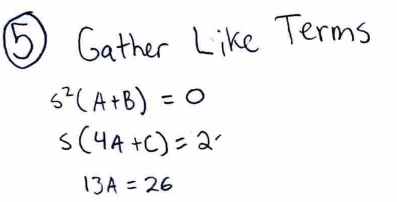 
 
Step 5. Gather like terms to set up equations to solve for A, B, and C.

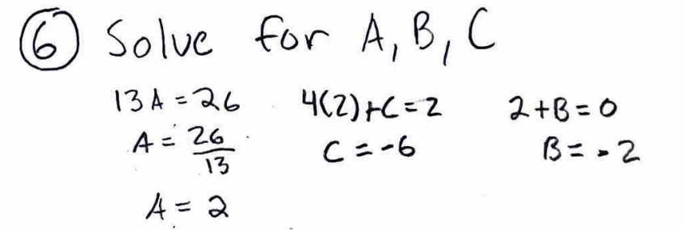 
 
Step 6. Solve for A, B, and C.

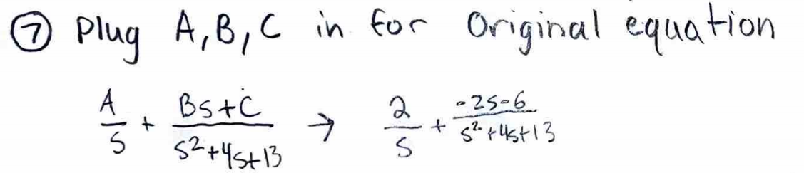 
 
Step 7. Input A, B, and C back into original equation

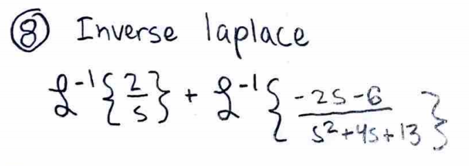 
 
Step 8. Inverse Laplace, however we need to reconstruct the equation so it matches one of the Laplace transform properties. 

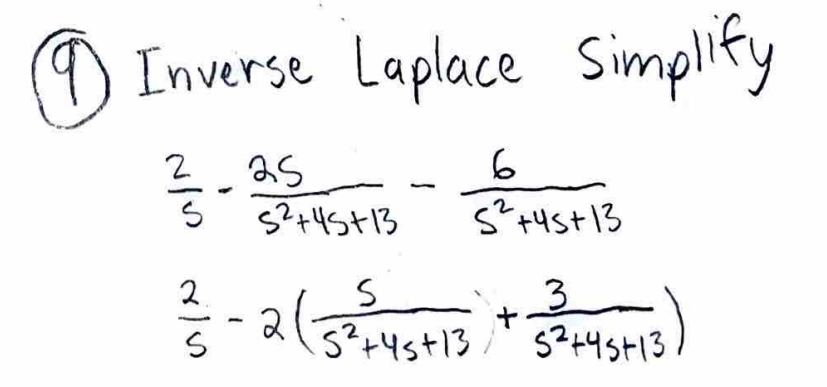 
 
Step 9. Seperate terms and factor out a two

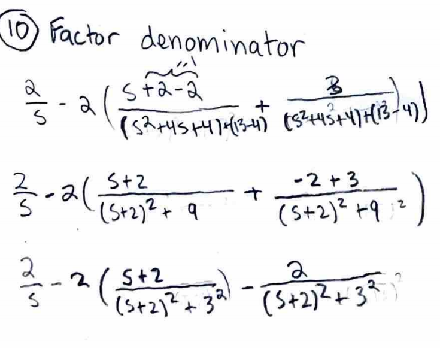 
  
Step 10. Add a (2-2) to numerator with s, and add (4-4) to denominator. This will allow the denominator to be equivalent to the final inverse Laplace transform from the table. Note((2-2)=0 and (4-4)=0 so adding this into the numerator and denominator does not change the equation.)

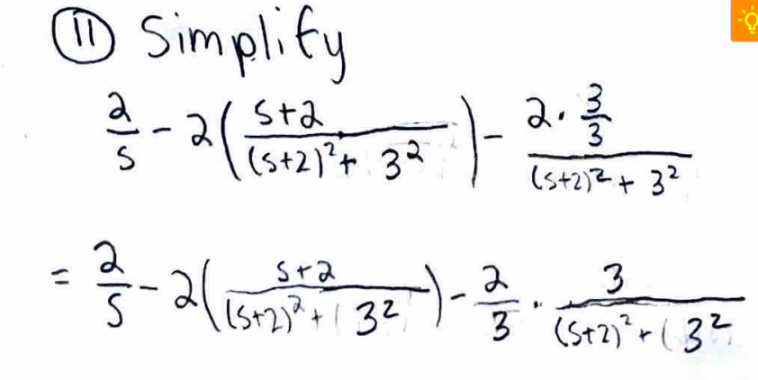 
 
Step 11.  Simplify equation and multiply numerator of -2 by 3/3, which is 1.

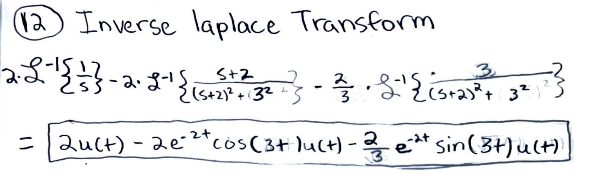 
  
Step 12.  Take the inverse laplce transform of the equation to get final answer (use Laplace transform chart).
