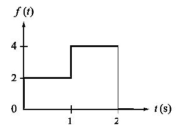
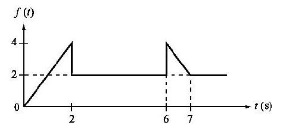
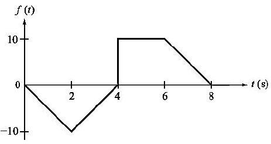

# Laplace Transformation Definition
The Laplace Transformation is a linear transformation between two vector spaces. It is used as a bypass strategy to solve complex differential equations by transforming the differential equation into an algebraic expression that is easier to solve.
  
Given a differential equation, that we are unable to solve, we apply the Laplace transform "&#8466; " to map it from the t-domain into an algebraic equation in the s-domain.  

 
  
 
We can then find a solution to the algebraic equation in the s-domain. Afterwards, we can use the inverse Laplace Transform “&#8466; $$^{-1}$$" to return the solution to the t-domain.
  
There are several advantages of using the Laplace Transformation when analyzing circuits  

* Since differential equations represent a RLC circuit in the time domain, the Laplace Transform is a powerful tool that allow us to use algebraic operations to analyze the circuit.
* It can provide insight into how a circuit behaves at different frequencies.
* It allows us to find the transfer function of the circuit. Knowing the transfer function can help us determine the circuit response to different inputs.
* It can be used to separate the transient and steady-state responses of a circuit.
* It is a simpler operation than convolution.
  
# The Laplace Transform Formula
Given a function f(t), the Laplace transform is defined as the transformation of $$f$$ to the function $$F$$. The following equation defines it:  

$$F(s)= \mathscr{L} {[f(t)]}= \int_{0}^{\infty} f(t)e^{-st} \; dt $$  

Where $$s$$ is a complex variable with a real part $$\sigma$$  and an imaginary part $$\omega$$  

 $$s=\sigma+j\omega$$ 

  
If the integral converges, the Laplace Transform of the function exists. If it diverges, the Laplace Transform of the function doesn’t exist.
  
Examples:  
Find the Laplace Transform of $$f(t)=1$$
  

$$\mathcal{L}{(1)}= \int_{0}^{\infty} e^{-st} \; dt$$

$$= \left. -\frac{e^{-st}}{s}  \right|_{0}^{\infty}$$

$$=\frac{1}{s}$$

  
Find the Laplace Transform of $$f(t)=t$$  

$$ \mathcal{L}{(t)}= \int_{0}^{\infty} te^{-st} \; dt$$ 

Using integration by parts:  

$$= \left. \frac{te^{-st}}{s}  \frac{e^{-st}}{s^2}\right|_{0}^{\infty}$$

$$=\frac{1}{s^2}$$

  
Find the Laplace Transform of $$f(t)=e^t$$ 

$$\mathcal{L}{(e^t)}= \int_{0}^{\infty} e^te^{-st} \; dt$$

$$= \int_{0}^{\infty} e^{-st+t} \; dt$$

$$= \int_{0}^{\infty} e^{-(s-1)t} \; dt$$

$$= \left. -\frac{e^{-(s-1)t}}{s-1}  \right|_{0}^{\infty}$$

$$=\frac{1}{s-1}$$

  
Luckily, the most common Laplace Transforms have already been integrated and are available in a table ready for use.  

# Properties of the Laplace Transform  
The Laplace Transform is a linear transformation so it preserves:  
* Scalar Multiplication  

$$\mathcal{L}{[C*f(t)]}=C*\mathcal{L}{[f(t)]}$$

* Addition

$$\mathcal{L}{[f(t)+g(t)]}=\mathcal{L} {[f(t)]}+\mathcal{L} {[g(t)]}$$

In general

$$\mathcal{L}{[C*f(t)+D*g(t)]}=C*\mathcal{L} [f(t)]+D*\mathcal{L}{[g(t)]}$$
  
  
## Several more properties are listed in the table below

 
  

# Examples

## Example 1:

$$f(t)={u(t)-u(t-1)}$$
 &nbsp;  

Using the Time Shift Property:

$$F(S)=\frac{1}{s}-\frac{e^{-s}}{s}$$

## Example 2:

$$f(t)=2tu(t-4)$$
 &nbsp;  

Using the Time Shift Property:

$$f(t)=2(t-4+4)u(t-4)$$

$$f(t)=2((t-4)u(t-4)+4u(t-4))$$

$$F(S)=2(\frac{e^{-4s}}{s^2}+\frac{4e^{-4s}}{s})$$

$$F(S)=\frac{2e^{-4s}}{s^2}+\frac{8e^{-4s}}{s}$$

## Example 3:

$$f(t)=10te^{-t}sin(2t)u(t)$$ 
 &nbsp;  

Using the Frequency Differentiation Property:

$$F(S)=-10(\frac{d}{ds}[\frac{2}{(s+1)^2+4}])$$ 

$$F(S)=-10(\frac{-4(s+1)}{((s+1)^2+4)^2})$$ 

$$F(S)=\frac{40(s+1)}{(s+2s+5)^2}$$ 

## Example 4: 

$$f(t)=5cos(t)\delta(t-2)$$ 

$$= F(s)=5cos(2)e^{-2s} \;$$ 

## Example 5:

$$f(t)=2tu(t)-\frac{d}{dt}\delta(t)$$ 
 &nbsp;  

Using the Time Differentiation Property:

$$F(S)=\frac{2}{s^2}-4s(1-0)$$ 

$$F(S)=\frac{2}{s^2}-4s$$ 

## Example 6:

 
  

$$f(t)={2u(t)+2u(t-1)-4u(t-2)}$$ 

$$F(S)=\frac{2}{s}+\frac{2e^{-s}}{s}-\frac{4e^{-s}}{s}$$ 

## Example 7:

 
  

$$f(t)={2tu(t)-2tu(t-2)-2u(t-2)}+2u(t-6)-2tu(t-6)+2tu(t-7)$$ 

$$F(S)=\frac{2}{s^2}-\frac{2e^{-2s}}{s^2}-\frac{2e^{-2s}}{s}+\frac{2e^{-6s}}{s}-\frac{2e^{-6s}}{s^2}+\frac{2e^{-7s}}{s^2}$$ 

## Example 8:

 

$$f(t)={-5tu(t)+10tu(t-2)-5tu(t-4)}+10u(t-4)-5tu(t-6)+5tu(t-8)$$ 

$$F(S)=-\frac{5}{s^2}+\frac{10e^{-2s}}{s^2}-\frac{5e^{-4s}}{s^2}+\frac{10e^{-4s}}{s}-\frac{5e^{-6s}}{s^2}+\frac{5e^{-8s}}{s^2}$$  
