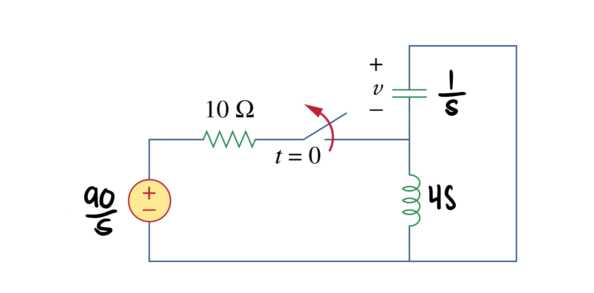
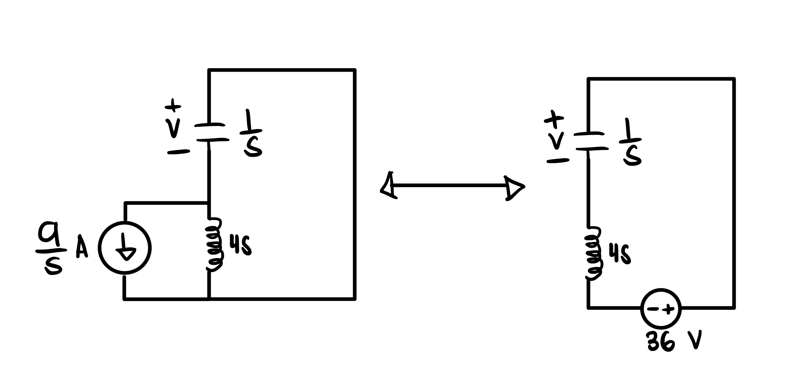
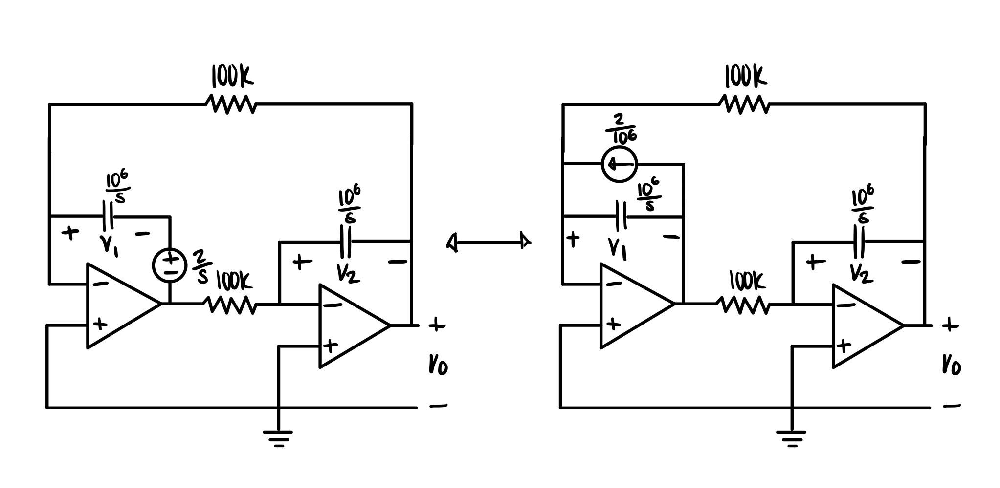
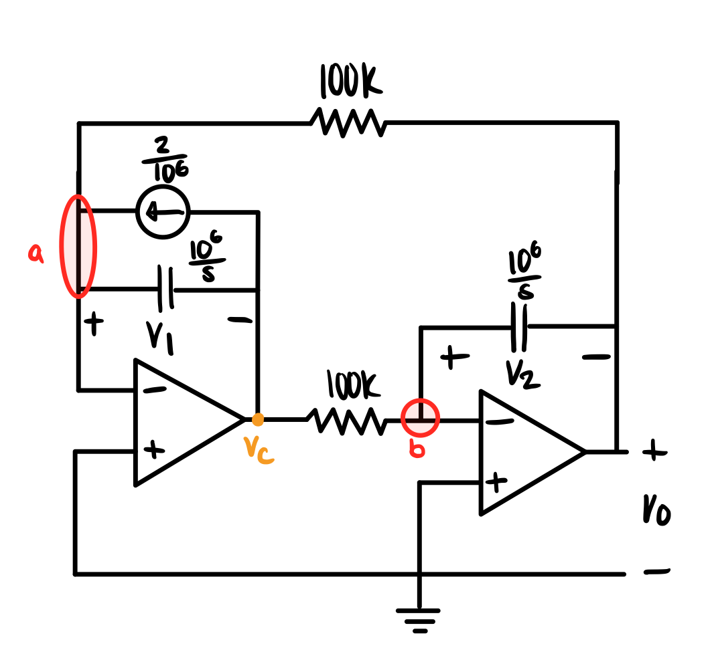

# Performing Laplace Transformation on Circuits With Initial Conditions

## General steps in applying the Laplace transform to circuits with initial conditions:
1. Transform the circuit from time domain to the s-domain
2. Find the initial condition across the inductor (current) and capacitor (voltage) if applicable
3. Flip the switch if applicable
4. Connect the initial conditions in parallel (current source) or in series (voltage source) to their respective elements
5. Use methods of circuit analysis such as nodal, mesh, source transformation, superposition, and other techniques that you are familiar with
6. Transform the solution back to time domain using inverse Laplace

## Problem Examples

### Example 1

 

#### Step 1: Transform the circuit from time domain to the s-domain using Laplace

 

**Explanation:**

Perform the Laplace transform to the capacitor, inductor, and voltage source.
* Don't forget to perform the Laplace to the voltage source. It may be a constant and you might arrive at the same solution without doing so for DC circuits, but it is good practice.

#### Step 2: Solve for the initial conditions

 $$ V_{C}(0) = 0 V$$ 

 $$ I_{L}(0) = \frac{9}{s} A$$ 

**Explanation:**

In steady-state for DC circuits, capacitors act as a break while inductors act as a wire. The capacitor is in parallel with the inductor, and thus, all the current will go through the path with the least resistance.

#### Step 3: Flip the switch

 

#### Step 4: Connect the initial conditions in parallel (current source) or in series (voltage source) to their respective elements

 

 $$ \frac{9}{s}(4s) = 36 V $$

**Explanation:**

Once you have your initial values, you can revert them from current to voltage and vice versa using source transformation. Use this [reference](assets/timetos-domainvisual.png) to get a better visualization of how the terminals of the sources are connected in the circuit.

#### Step 5: Use methods of circuit analysis such as nodal, mesh, source transformation, superposition, and other techniques that you are familiar with

 $$ V_{C}(s) = \frac{36}{4s^{2}+1} V $$ 

**Explanation:**

You may use mesh analysis on the left circuit, or KVL on the right.

#### Step 6: Transform the solution back to time domain using inverse Laplace

 $$ \mathcal{L}^{-1}(V_{C}(s)) = 18sin(\frac{1}{2}t)u(t) V $$ 

 $$ v(t) = 18sin(\frac{1}{2}t)u(t) V$$ 

### Example 2

 
  

#### Step 1: Transform the circuit from time domain to the s-domain

 
 

#### Step 2: Connect the initial conditions in parallel (current source) or in series (voltage source) to their respective elements

 
 

 $$ \mathcal{L}(v_{1}(0^{+})) = \frac{2}{s}$$ 

 $$ V_{1}(0^{+}) = \frac{2}{s} V $$

 $$ I_{1}(0^{+}) = \frac{\frac{2}{s}}{\frac{10^{6}}{s}} = \frac{2}{10^{6}} A $$ 

**Explanation:**

Since the only capacitor that has an initial voltage is the first one, the second capacitor will be left alone.  
You must perform the Laplace transformation on the initial voltage, $$ v_{1}(0^{+}) $$, before including it into the circuit. It is easier to solve for $$ V_{o}(s) $$ through nodal analysis after performing source transformation to replace the voltage source with a current source.

#### Step 3: Use methods of circuit analysis such as nodal, mesh, source transformation, superposition, and other techniques that you are familiar with

 
 

 $$ -\frac{V_{o}}{100*10^3} - \frac{V_{c}}{\frac{10^{6}}{s}} - \frac{2}{10^{6}} = 0 \tag{a}$$ 

 $$ -\frac{V_{c}}{100*10^{3}} - \frac{V_{o}}{\frac{10^{6}}{s}} = 0 \tag{b}$$ 

 $$ V_{o}(s) = \frac{20}{s^{2}-100} V $$ 

**Explanation:**

Use nodal analysis on nodes a, and b. While there is no current that passes through the negative and positive terminals of an ideal op-amp, the voltage difference between the terminals will always be zero. Since the positive terminals of both op-amps are connected to ground, and are thus zero, the negative terminals will also have zero voltage. With this in mind, nodes a and b will have zero voltage.

As a result, you will end up with two systems of equations, and two unknowns ($$V_{o}(s)$$ and $$V_{c}(s)$$).

#### Step 4: Transform the solution back to time domain using inverse Laplace

 $$ \mathcal{L^{-1}}(V_{o}(s)) = \mathcal{L^{-1}}(\frac{20}{s^{2}-100}) $$ 

 $$ v_{o}(t) = (e^{10t} - e^{-10t})u(t) V$$ 
