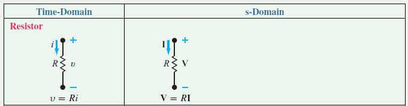
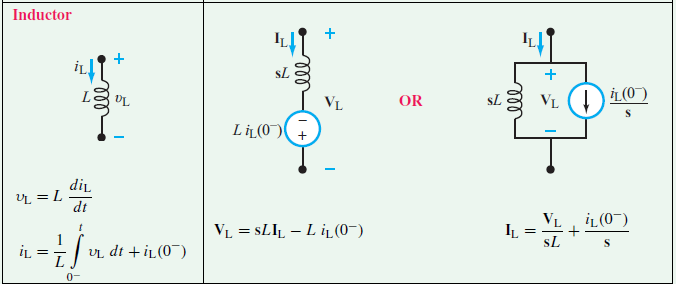
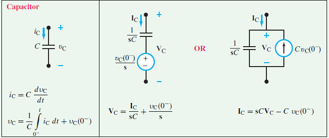

# Laplace Transform of Resistors, Inductors, and Capacitors With Initial Conditions
## Prerequisite Knowledge
Before continuing, you must have covered:  
* Voltage-current relationships for ideal resistors, capacitors, and inductors  
* Methods of circuit analysis  
* Laplace transformation
* Inverse Laplace transformation

## Resistors  

 
  
  
The Laplace transformation of a resistor's impedence with a value of $$R$$ is $$R$$.
   
The voltage-current relationship for a resistor in the time domain is  

 $$v(t) = Ri(t)$$  
  
By taking the Laplace transform, it is transformed into the s-domain

 $$V(s) = RI(s)$$ 
  

## Inductors  

 
  
  
Unlike resistors which dissipate energy and thus are independent of frequency (also expressed through Ohm's Law), inductors store energy when *current* flows through them, and thus are frequency-dependent.
  
This can also be expressed through the equation

 $$v_{L}(t) = L\frac{di_{L}(t)}{dt}$$ 

  
By using the Laplace transform ([reference](assets/LaplaceTransformTable.PNG)), it is transformed into the s-domain.

$$\mathcal{L}(v_{L}(t)) = \mathcal{L}(L\frac{di_{L}(t)}{dt})$$
$$V_{L}(s) = L[sI_{L}(s)-i_{L}(0^-)] $$  
$$V_{L}(s) = sLI_{L}(s) - Li_{L}(0^{-})$$  
$$V_{L}(s) - sLI_{L}(s) + Li_{L}(0^{-}) = 0$$

  
The second equation might provide a better perspective of how each component contributes to the total voltage. Notice that in the s-domain of the table of circuits above, $$sLI_{L}(s)$$ represents the voltage drop across the inductor, and $$Li_{L}(0^{-})$$ represents the initial voltage going across the inductor when $$t=0$$ in the form of a voltage source. Since inductors oppose changes in current, when the initial condition is applied as a voltage source, its polarity is opposite to the voltage across $$sL$$. When applied as a current source, its direction is the same as the current across $$sL$$.
  
The voltage source can be tranformed into a current source using **source transformation** and be connected parallel to the inductor. This can also be obtained by isolating $$I_{L}(s)$$ from the previous equations  

 $$I_{L}(s) = \frac{V_{L}(s)}{sL} + \frac{i_{L}(0^-)}{s} $$  
$$I_{L}(s) - \frac{V_{L}(s)}{sL} - \frac{i_{L}(0^-)}{s} = 0$$ 

  
The second equation might provide a better perspective of how the current is split between branches. Going back to the table, $$\frac{V_{L}(s)}{sL}$$ represents the current going across the inductor, and $$\frac{i_{L}(0^-)}{s}$$ represents the current that was initially going across the inductor when $$t=0$$. Similarly, the current source can be transformed into a voltage source using source transformation, and be connected in series to the inductor.
  
## Capacitors  

 
  
  
Similar to inductors, capacitors also store energy and are frequency-dependent, but it occurs when there's *voltage* going across it.
  
This can be expressed through the equation  

 $$i_{C}(t) = C\frac{dv_{C}(t)}{dt}$$ 

  
By using the Laplace transform, it is transformed into the s-domain  

$$\mathcal{L}(i_{C}(t)) = \mathcal{L}(C\frac{dv_{C}(t)}{dt}) $$  
$$I_{C}(s) = C[sV_{C}(s) - v_{C}(0^{-})]$$  
$$I_{C}(s) = sCV_{C}(s) - Cv_{C}(0^{-})$$
$$I_{C}(s) - sCV_{C}(s) + Cv_{C}(0^{-}) = 0$$

  
On the table above for capacitors, $$sCV_{C}(s)$$ represents the current going across the capacitor, and $$Cv_{C}(0^{-})$$ represents the current that was initially going across the capacitor when $$t=0$$ in the form of a current source. Since capacitors oppose changes in voltage, its initial condition as a current source will have the opposite direction as the current going across the capacitor ($$\frac{1}{sC}$$). When the initial condition is applied as a voltage source, its polarity will be the same as the voltage going across $$\frac{1}{sC}$$.
  
The current source can also be transformed back into a voltage source in series with the capacitor using source transformation. Additionally, $$V_{C}(s)$$ can be isolated from the previous equation, resulting in  

 $$V_{C}(s) = \frac{I_{C}(s)}{sC} + \frac{v_{C}(0^{-})}{s}$$  
$$V_{C}(s) - \frac{I_{C}(s)}{sC} - \frac{v_{C}(0^{-})}{s} = 0$$

