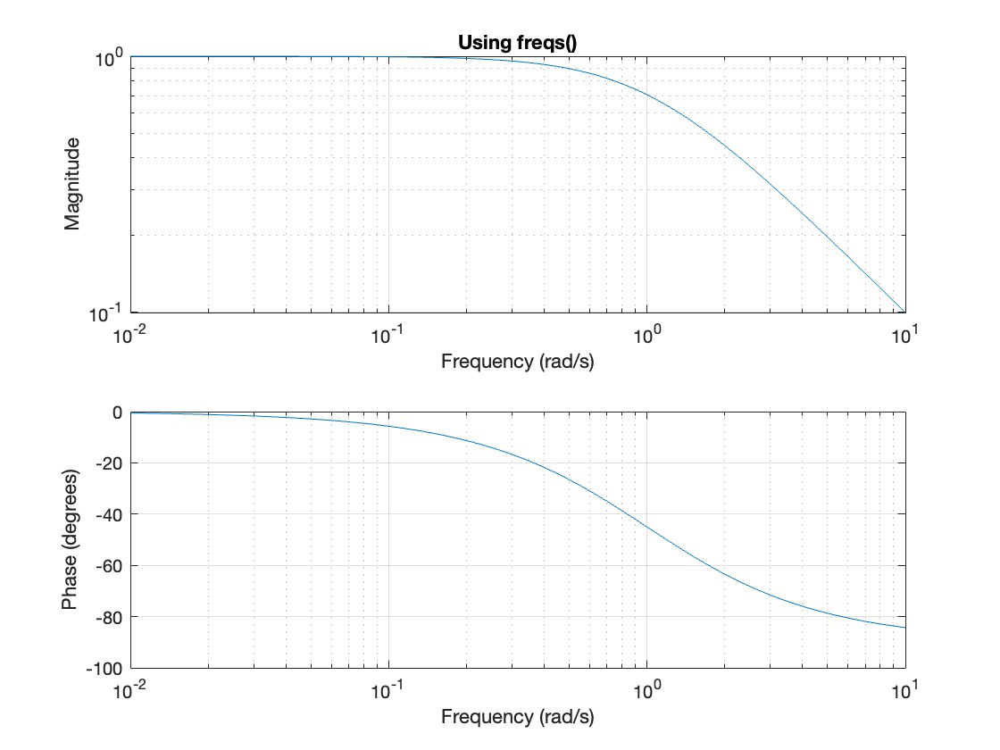
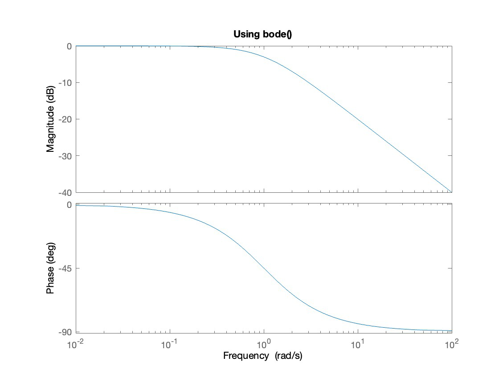
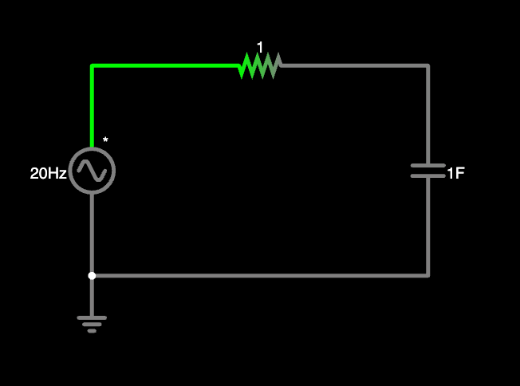
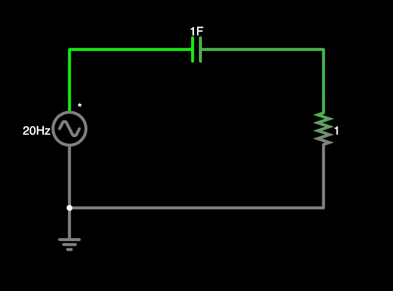

# Transfer Functions and Frequency Response

### Transfer Function

Using phasors, we learned to solve circuit values for specific frequencies. In reality, sources can be a combination of frequencies. To determine how circuits perform under these conditions we need to utilize the **transfer function**.

In general the transfer function takes the form **$$\frac{out}{in}$$**. It is a comparison of the output to the input. We generally solve voltages or currents as inputs and outputs. There are four possible types of transfer functions:

- Voltage gain - \\(\frac{V_o}{V_i}\\)

- Current gain - \\(\frac{I_o}{I_i}\\)

- Transfer Impedance - \\(\frac{V_o}{I_i}\\)

- Transfer Admittance - \\(\frac{I_o}{V_i}\\)

#### Frequency Domain (s) vs. Time Domain (t)

Transfer functions can be written as both a function of time (h(t)) and a function of frequency (H(s)). We find H(s) to be most useful for us in this course. We can easily convert between the two domains using Laplace transforms, which will be discussed later.

Hint: When given a problem in the time domain, it is okay to convert to the frequency domain. However, remember to convert back to the time domain!

### Frequency Response - Bode Plots  

We can plot the magnitude and phase of H(s) to see how it varies with frequency. We need the function to be in a specific form.

$$H(s) = \frac{N(s)}{D(s)}$$ where N(s) & D(s) are polynomials

N(s) has the form: $$as^{n} + bs^{n-1} + cs^{n-2} + \cdots + ys + z$$

D(s) should have same form, we'll use: $$vs^{n} + ws^{n-1} + xs^{n-2} + \cdots + ys + z$$ 

#### Straight Line Approximations

Using the standard form of the transfer function H($\omega$), we plot each factor separately and then add them together to get the final approximation.

1. Rearrange the transfer function so that it is in the form:

$$H(\omega) = \frac{K(j\omega)^{±1}(1 + j\omega/z_{1})[1 + j2\xi\omega/\omega_{k} + (j\omega/\omega_{k})^{2}] \cdots}{(1 + j\omega/p_{1})[1 + j2\xi_{2}\omega/\omega_{n} + (j\omega/\omega_{n})^{2}] \cdots}$$

2. Using $$H_{dB} = 20\log_{10} \vert H \vert $$ to convert the gain K to decibels

3. Determine zeros (numerator) & poles (denominator) and use the [bode plot chart](assets/BodePlotCheatSheet.png) to graph

4. Graph the final approximation line

This [reading](assets/BodePlotsByHand.pdf) provides a more detailed description of how to plot bode plots by hand. Here are some [extra practice problems](assets/BodePlotEstimations.pdf).

The bode plot chart is an extremely helpful tool, be sure to understand it!  

#### Matlab Code

Using Matlab we can create bode plots using the command freqs() or bode().

- A vector for the coefficients of the numberator can be created as [a b c d e]

- A vector the the coefficients of the denominator can be created as [v w x y z] 

Using the transfer function, $$H(s) = \frac{1}{s + 1}$$the following code can be used:

`>> num = [1];`

`>> den = [1 1];`

`>> freqs(num,den)` or `>>bode(num,den)`  

A shortcut to write this code is:

`>>freqs([1], [1 1])` or `>> bode([1], [1 1])`
  

The bode command will output the frequency response with the magnitude in decibels (dB). This plot is easier to compare with your straight line approximations.

#### Converting to Decibels

To convert $$\vert H \vert$$ to $$H_{dB}$$ we use the equation $$H_{dB} = 20log_{10}\vert H\vert $$.

It is important to note that in this course we use the half power frequency to determine the cutoff frequency. That is when $$\vert H \vert \le \frac{1}{\sqrt{2}}$$ or $$H_{dB} \le -3 dB$$, an input signal is considered cutoff or filtered out.

  
### Analysis Using Physical Arguments

It is possible to predict the output of the circuit by using physical arguments and analyzing at very low and very high frequencies. We can use this analysis method to predict what type of filter a circuit is.

| Frequency | Output |
|---|---|
| Very low ($$\omega → 0$$) ($$\omega = 0$$ is DC) | Capacitor acts as break, inductor acts as wire|
| Very high ($$\omega → \infty$$)| Capacitor acts as wire, inductor acts as break|

Apply these rules to the circuit and examine the output of the circuit. E.g. If at very low frequencies the output is the same as the input and at high frequencies the output is zero, then this is a lowpass filter (passes low frequencies).

#### Example (Falstad)

Consider the circuit below (linked [here](https://www.falstad.com/circuit/circuitjs.html?ctz=CQAgjCAMB0l3BWEAmALNVA2AnGbBmZZTVIyVEQkJBSagUwFowwAoAN3GQA4VvewPLrzoRkdJHSnQErAE7DF+bhUEjwrAMaUVS3T3UQY5BETCoEAdmzJ8FwdgrHIbAO46KBxV8isA5t78SuJQUKwA9uAgJKGokNjY4HSYGKHIUfgRKNFOIHEJULCW3IJIKbnp6ZlAA))

The input is a voltage of arbitrary frequency, and the output is the voltage across the capacitor. This means that the transfer function would be $$H(s) = \frac{V~o}{V~i} = \frac{1}{s + 1}$$ where $$s = j\omega$$.
You can verify this using basic circuit analysis.

  

It is important to note that the transfer function is not a function of time but rather a function of frequency (s-domain).

  

Using the physical arguments above we can analyze the circuit at very low and very high frequencies.

In this case we see that...

- As $$\omega → 0$$ (very low frequency): $$H(s) = 1$$

- As $$\omega → \infty$$ (very high frequency): $$H(s) = 0$$
  
We can conclude that this is a **lowpass filter**. Low frequency inputs pass through the filter and high frequency outputs are filtered out.

### Experiment

Try using the simulator link above to the circuit. You can vary the input frequency from 0 Hz to 25k Hz. Compare the input amplitude with the output amplitude for different frequencies. What do you notice?

### Try it yourself

Given the circuit linked ([here](https://tinyurl.com/2a8o6xpp)). The input is the voltage source and the output is the voltage across the resistor.

1. Use physical arguments to solve the value of the transfer function at very low and very high frequencies. Is this a lowpass? or highpass filter?

2. Solve the transfer function $$H(s) = \frac{V_o}{V_s}$$. Is this consistent with your answer for part 1?

3. Draw the straight line approximation of the the bode plot

4. Plot the frequency response in Matlab. Is this consistent with your answer for part 3?
